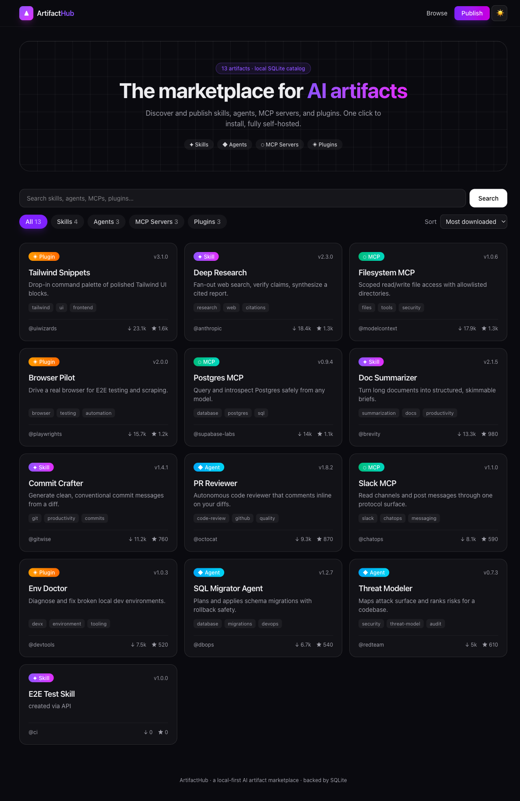

# ArtifactHub — AI Artifact Marketplace

A full-stack marketplace for **AI artifacts**: skills, agents, MCP servers, and plugins.
Browse a catalog, filter by type, search, view rich detail pages with install commands,
and publish your own — all backed by a **local SQLite database**.

  

## 🌐 Live deployment

| | |
|---|---|
| **Source repo** | https://github.com/srikanthvejendla/ai-artifact-marketplace |
| **Live URL (public)** | https://introduced-schools-special-portal.trycloudflare.com |

The production build (`pnpm build && pnpm start`) runs on `:8001` and is published to the
public internet via a **Cloudflare quick tunnel** (`cloudflared tunnel --url http://localhost:8001`).
The app is served from a local machine, so the URL is reachable only while that machine, the
Next.js server, and the tunnel are all running.

> **Bring it back up / rotate the URL:**
> ```bash
> pnpm build && pnpm start                          # serves on :8001
> cloudflared tunnel --url http://localhost:8001     # prints a fresh https://*.trycloudflare.com URL
> ```
> A quick tunnel mints a new random hostname each run. For a stable custom domain, use a named
> Cloudflare tunnel (requires a Cloudflare account). Tailscale Funnel/Serve are also viable but
> need a one-time per-tailnet admin enablement.



## Features

- **Four artifact types** — skills, agents, MCPs, plugins, each with its own badge and accent.
- **Browse, filter & search** — filter by type, full-text search across name/tagline/tags/author, sort by downloads, rating, recency, or name.
- **Rich detail pages** — description, README/details, tags, homepage, and a one-click install (copies the command + increments the install counter via the API).
- **Publish flow** — a validated form (`/submit`) that writes new artifacts to SQLite.
- **REST API** over the same data layer.
- **Dark / light mode** with persisted preference, responsive design, polished gradient UI.
- **Local-first** — zero external services; the catalog lives in `data/marketplace.db`.

## Stack & rationale

**Next.js 15 (App Router) + TypeScript + Tailwind v4 + better-sqlite3.**
The marketplace is dynamic (publishing, counters, search), so a single deployable that
co-locates server-rendered UI, REST route handlers, and synchronous SQLite access is the
cleanest fit. See [`docs/stack-decision.md`](docs/stack-decision.md) for the alternatives
considered.

## Getting started

```bash
pnpm install
pnpm seed        # optional — the app also self-seeds on first load
pnpm dev         # http://localhost:8001
```

Production:

```bash
pnpm build
pnpm start       # http://localhost:8001
```

## Environment

| Var | Default | Purpose |
|---|---|---|
| `DATABASE_PATH` | `./data/marketplace.db` | Location of the SQLite file |

See [`.env.example`](.env.example).

## API

| Method | Route | Description |
|---|---|---|
| `GET` | `/api/artifacts?type=&q=&sort=` | List / filter / search artifacts |
| `POST` | `/api/artifacts` | Create an artifact (JSON, validated) |
| `GET` | `/api/artifacts/:slug` | Fetch one artifact |
| `POST` | `/api/artifacts/:slug/install` | Increment install count |

`sort` ∈ `popular | stars | recent | name`. `type` ∈ `skill | agent | mcp | plugin`.

Create payload:

```json
{
  "name": "My Skill",
  "type": "skill",
  "tagline": "One-liner",
  "description": "Longer text",
  "author": "you",
  "version": "1.0.0",
  "install_cmd": "npx artifact add skill my-skill",
  "homepage": "https://…",
  "tags": "a, b, c",
  "content": "README…"
}
```

## Data model

`artifacts(id, slug, name, type, tagline, description, author, version, homepage, install_cmd, content, tags, downloads, stars, created_at)`

## Tests

```bash
pnpm test        # node:test — validation, db CRUD, seeding, slug uniqueness
```

## Project layout

```
src/
  app/
    page.tsx                 # home: hero + filters + grid
    a/[slug]/page.tsx        # artifact detail
    submit/page.tsx          # publish form
    api/artifacts/...        # REST handlers
  components/                # Navbar, Filters, ArtifactCard, InstallButton, …
  lib/                       # db.ts (SQLite), types.ts, validate.ts, seed.ts
data/marketplace.db          # local SQLite catalog (gitignored)
```
